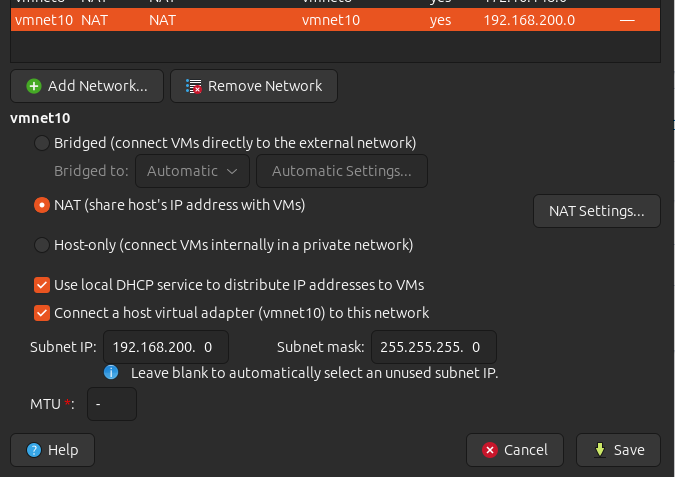
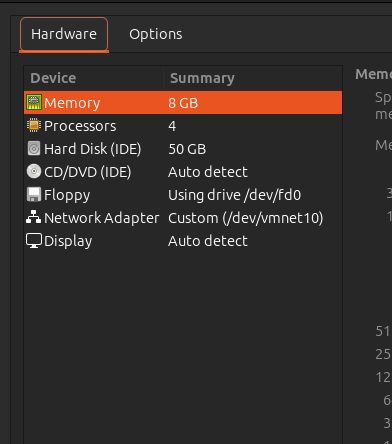
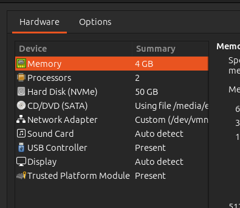
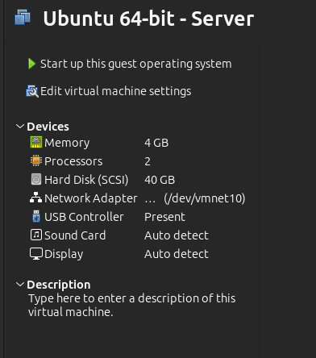
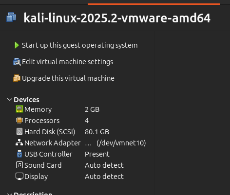
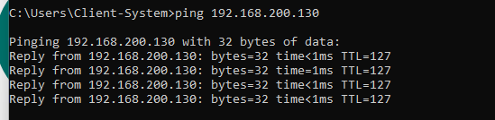
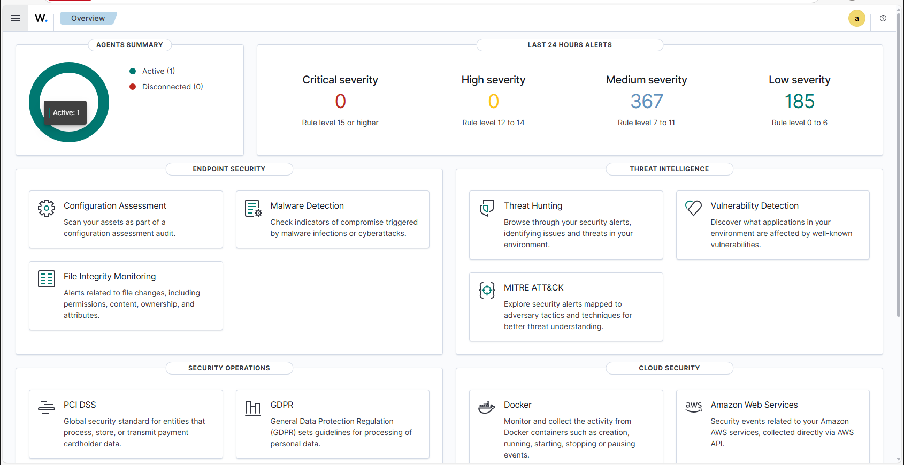
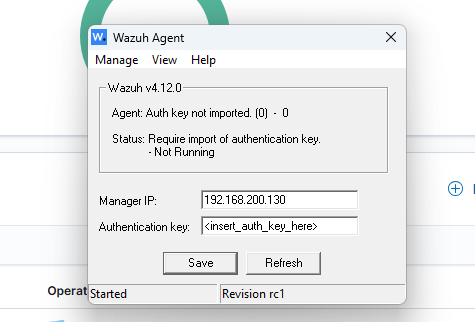

# Wazuh SOC Lab – Technical Documentation

## 1. Objective

The purpose of this project is to build and document a Security Operations Center (SOC) lab using **Wazuh** as the SIEM.  
The lab simulates a small enterprise environment with Windows, Linux, and Kali endpoints forwarding logs to a central Wazuh Manager.

This report serves as detailed technical documentation for the build process, challenges faced, and lessons learned.

---

## 2. Environment Setup

### Hypervisor

- **VMware Workstation Pro 17**

### Virtual Network

- **Network Type:** Custom NAT (VMnet10)
- **Subnet:** 192.168.200.0/24
- **Configuration:**
  - Enabled DHCP for dynamic assignment
  - Host virtual adapter connected
  - NAT enabled (VMs share host internet if required)

**Screenshot:**  


### Virtual Machines

| VM            | OS / Version        | Specs                  | IP Address      |
| ------------- | ------------------- | ---------------------- | --------------- |
| Wazuh Server  | Wazuh OVA (Debian)  | 8GB RAM, 4 vCPUs, 50GB | 192.168.200.130 |
| Windows 11    | Enterprise (ISO)    | 4GB RAM, 2 vCPUs, 50GB | 192.168.200.128 |
| Ubuntu Server | 22.04 LTS           | 4GB RAM, 2 vCPUs, 40GB | 192.168.200.131 |
| Kali Linux    | 2025.2 VMware Image | 2GB RAM, 4 vCPUs, 80GB | 192.168.200.129 |

**Screenshots:**

- 
- 
- 
- 

### Connectivity Test

- Verified all VMs could communicate within the subnet.
- Windows client successfully pinged Wazuh Server (`192.168.200.130`).

**Screenshot:**  


---

## 3. Key Setup Challenges & Solutions

### A. Creating a Custom NAT Network (VMnet10)

- **Issue:** Out-of-the-box, VMware did not have a clean isolated subnet for lab machines.
- **Solution:**
  1. Opened **Virtual Network Editor**
  2. Created **VMnet10** → set to **NAT**
  3. Subnet: `192.168.200.0/24`
  4. Enabled DHCP + host adapter
  5. Saved settings, assigned all VMs to VMnet10

✅ Result: Machines can communicate with each other and share internet if required.

---

### B. Installing Windows 11 Without Internet

- **Issue:** Windows 11 installer was stuck at _“Let’s Connect You to a Network”_ and would not allow skipping.
- **Solution:**
  - Pressed **Fn + Shift + F10** → launched Command Prompt
  - Executed command:
    ```
    oobe\bypassnro
    ```
  - Machine rebooted, bypassed the forced network screen, and allowed offline installation.

✅ Result: Windows 11 installed successfully for lab use.

---

## 4. Wazuh Server Deployment

- Imported official Wazuh OVA into VMware.
- Allocated 8GB RAM, 4 CPUs, and 50GB storage.
- Booted successfully, IP assigned: `192.168.200.130`.
- Accessed dashboard at: `https://192.168.200.130:55000`

**Screenshot:**  


---

## 5. Windows Client Integration

- Installed **Wazuh Agent v4.12.0** on Windows 11 (`192.168.200.128`).
- Configured **Manager IP**: `192.168.200.130`
- Imported authentication key to register agent.
- Verified registration → Dashboard shows **1 Active Agent**.

**Screenshots:**

- 
- 

---

## 6. Current Status

- ✅ SOC baseline environment operational
- ✅ Windows agent integrated and sending logs
- ✅ Wazuh Dashboard confirms log ingestion

---
## 7. Ubuntu Server Agent Integration

### Access Challenges

Accessing the Ubuntu VM directly from the VMware console made it difficult to paste commands during installation.  
**Workaround:** I SSH’d into the Ubuntu server (`192.168.200.131`) from my Windows machine, which allowed me to copy/paste commands more easily.

### Research & Approach

- Initial attempts to follow multiple guides for installing the Wazuh agent on Ubuntu did not work.
- Finally discovered that the **Wazuh Dashboard → Agent Management → Deploy new agent** feature provides exact installation instructions tailored to the endpoint.
- This generates commands that can be copied to the Ubuntu terminal to download, install, and connect the agent to the Wazuh manager.

### Misconfiguration Issue

- **Mistake:** During installation, I mistakenly configured the agent with its own IP (`192.168.200.131`) instead of the Wazuh Manager’s IP (`192.168.200.130`).
- **Result:** The agent was installed but could not communicate with the manager.
- **Fix:** Updated the configuration file manually:

```xml
<server>
  <address>192.168.200.130</address>
  <port>1514</port>
  <protocol>tcp</protocol>
</server>
```
*Command to edit the configuration file:*
```bash
sudo nano /var/ossec/etc/ossec.conf
```
Saved the file and re-registered the agent.

### Agent Registration

*Run the following on the Ubuntu server to register the agent with the Wazuh Manager:*
```bash
sudo /var/ossec/bin/agent-auth -m 192.168.200.130
```

*Start & Enable the Agent:*
```bash
sudo systemctl enable wazuh-agent
sudo systemctl start wazuh-agent
sudo systemctl status wazuh-agent
```

### Verification

*From manager side:*
```bash
/var/ossec/bin/list_agents
```
Confirmed the Ubuntu server agent was registered.

*From dashboard:*  
Ubuntu Server (`192.168.200.131`) appeared as active.

**Screenshot:**  


## 8. Next Steps

- Simulate security events from **Kali Linux** and monitor detection.
- Enable **File Integrity Monitoring (FIM)** on Windows.
- Explore **MITRE ATT&CK mapping** within Wazuh.

---

## 9. Lessons Learned
- Custom VMnet networks in VMware are critical for isolated lab environments.
- Windows 11 requires bypass tricks (`oobe\bypassnro`) to install without internet.
- Wazuh OVA simplifies deployment since it includes Filebeat, Elasticsearch, and Dashboard pre-configured.
- Documentation is just as important as configuration — screenshots + notes make replication easier.
- Always confirm the <server><address> in ossec.conf points to the Wazuh Manager IP, not the agent’s own IP.
- The “Deploy new agent” option on the Wazuh Dashboard greatly simplifies installation — it provides exact commands for the endpoint OS.
- SSH access from Windows made configuration smoother compared to using the VMware console.

---

📌 *Maintained by Oluwagbenga Ogungbemi – Repo: 53cur3dL34rn*
```
